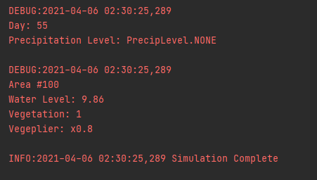
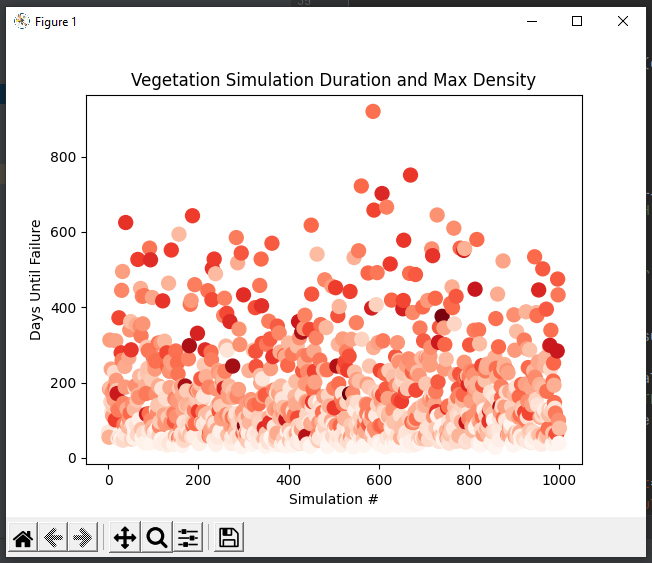
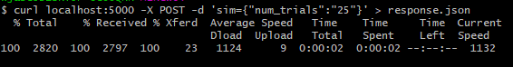
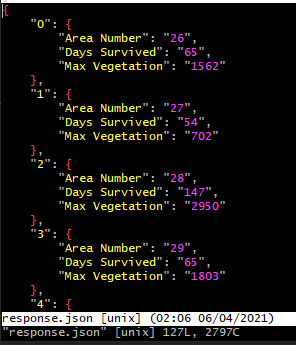

# BioSim

## About this project

BioSim is a basic environment simulator that tracks vegetation and precipitation values over time.  The
more "balanced" the environment's initial conditions are tuned, the longer the simulation will run before all of the vegetation dies out.

To experiment with getting the best initial conditions, the simulator can be run
repeatedly and viewed in aggregate through a weighted scatterplot.

The goal of this project was to generate data in a fun way to practice both Python general skills and use of 
Python statistics libraries such as numpy and matplotlib.

Skills used:

	- matplotlib.pyplot
		- scatter plots
		- axis labeling
		- custom data plot
		- color maps
	- numpy
		- genfromtxt() (to read csv)

## Features

* Model parameters adjustable through configuration file
* CLI configurable options
* CSV and JSON report generation
* Logging of simulation outputs

* Color-weighted scatterplot visualization

* API endpoint for web delivery

